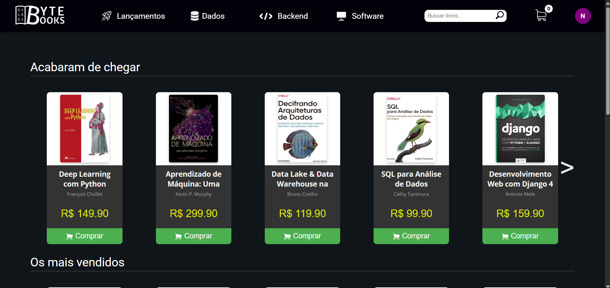

# ByteBooks

ByteBooks é uma plataforma de e-commerce de livros voltada para desenvolvedores, permitindo que usuários se cadastrem, explorem e "comprem" títulos focados em tecnologia.

Acesse o deploy do projeto: https://bytebooks-kappa.vercel.app/

<p align="center">
  
</p>

## 📝 Sumário
- [Descrição](#descrição)
- [Tecnologias](#tecnologias)
- [Arquitetura](#arquitetura)
- [Pré-requisitos](#pré-requisitos)
- [Instalação e configuração](#instalação-e-configuração)
- [Contribuição](#contribuição)
---

## Descrição
- Plataforma full-stack: backend em Django e frontend em Vue.js
- Público-alvo: desenvolvedores de software
- Recursos principais:
  - Catálogo de livros com filtros por linguagem e categoria
  - Autenticação JWT para segurança de API
  - Gerenciamento de carrinho de compras e finalização de pedido
  - Dashboard de administrador para controle de produtos e pedidos

## Tecnologias
- **Back-end**: Django 4.x, Django REST Framework
- **Front-end**: Vue.js 3.x, Vuex
- **Banco de dados**: SQLite (padrão para desenvolvimento local)
- **Autenticação**: JSON Web Tokens (JWT)
- **Controle de versão**: Git / GitHub

## Arquitetura
- API RESTful expõe endpoints para operações de usuários, produtos e pedidos
- Front-end consome API usando Axios e gerencia estado com Vuex
- Banco de dados SQLite para ambiente de desenvolvimento

## Pré-requisitos
- **Python** >= 3.10
- **Node.js** >= 18
- **Virtualenv** (para isolar dependências)

## Instalação e configuração
1. **Clonar repositório** (use a branch `dev`)
   ```bash
   git clone -b dev https://github.com/pucciNatan/ByteBooks.git
   cd bytebooks
   ```
2. **Criar e ativar virtualenv**
   ```bash
   cd backend
   python -m venv venv
   source venv/bin/activate  # Linux/Mac
   # ou
   venv\Scripts\activate     # Windows
   ```
3. **Configurar variáveis de ambiente** no arquivo `secret.env` dentro da pasta `backend`:
   ```secret.env
   MY_SECRET=sua_chave_jwt
   ```
4. **Instalar dependências do backend, criar conta ADM e rodando localmente**
   ```bash
   pip install -r requirements.txt
   python manage.py migrate
   python manage.py createsuperuser #Aqui você preenche as infos com oque você quiser pra criar sua conta ADM
   python manage.py runserver
   ```
5. **Instalar dependências do frontend**
   #Enquanto um terminal está rodando o backend, abra outro terminal e navegue até a pasta frontend do projeto
   ```bash
   cd frontend
   npm install
   ```

## Executando localmente o frontend
- **Frontend**
  ```bash
  npm run serve
  ```

## Agora com o front e back rodando, você consegue entrar nessa URL pra fazer oque quiser
- http://localhost:8080/ -> O site
- http://localhost:8000/admin -> Painel admin pra cadastrar novos livros / combos. Logue com a conta admin que você criou 

## Contribuição
- Fork deste repositório
- Criar branch com sua feature ou correção (`git checkout -b feature/nome`)
- Commitar alterações (`git commit -m "Descrição da alteração"`)
- Abrir Pull Request

